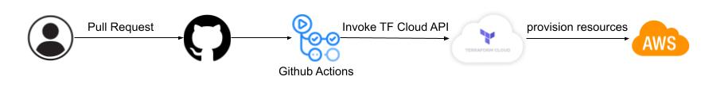
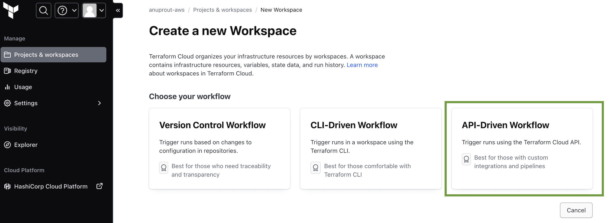
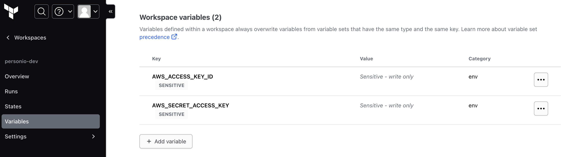
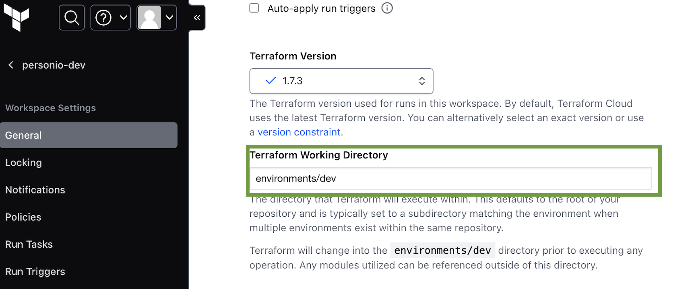

# personio-infra

Sample code that provisions an EKS cluster and an ECR using Terraform. Below is the high level deployment flow.



## Prerequisites
- a [Terraform Cloud account](https://app.terraform.io/signup/account?utm_source=learn) and organization.
- a [Terraform Cloud variable set configured with your AWS credentials](https://developer.hashicorp.com/terraform/tutorials/cloud-get-started/cloud-create-variable-set).
- an [AWS account](https://portal.aws.amazon.com/billing/signup?nc2=h_ct&src=default&redirect_url=https%3A%2F%2Faws.amazon.com%2Fregistration-confirmation#/start)

## Set up
The GitHub Action will connect to Terraform Cloud to plan and apply the configuration. Before you set up the Actions workflow, you must create a workspace, add your AWS credentials to your Terraform Cloud workspace, and generate a Terraform Cloud user API token.

- On TF cloud, go to the `Create a new Workspace page` and select `API-driven workflow`.

  

  Add the following as Environment Variables for your workspace.

  
  > **Note:**
  > - The AWS credential used above must have all required IAM permissions to create the resources.
  > - Create a separate workspace for each environment defined under `environments` dir.

  For each workspace, set the `Terraform Working Directory` pointing to the corresponding `environments` dir. This is important to trigger the TF plan & apply using the correct TF files for an environment. 
  
  
- Go to the [Tokens page](https://app.terraform.io/app/settings/tokens?utm_source=learn) in your Terraform Cloud User Settings. Click on Create an API token, enter GitHub Actions for the Description, then click Generate token.
- Set a Github Actions secret `TF_API_TOKEN` with above TF token. This will be used by the Github workflow to access TF cloud API.

## Terraform Code Layout
``` 
tree ./terraform 
./                                          // top level directory for all terraform code
├── environments                            // directory for env specific configurations
│   ├── dev                                 // terraform configuration for dev environment
│   │   ├── main.tf
│   │   ├── terraform.tf
│   │   └── variables.tf
│   └── prod                                // terraform configuration for prod environment
│       ├── main.tf
│       ├── terraform.tf
│       └── variables.tf
└── modules                                 // local terraform modules that may be shared across environments
    └── sample_go_app                       // application module (to be customized for any given application)
        ├── datasources.tf                  
        ├── eks.tf                          // TF code to build an EKS cluster and other required AWS resources
        ├── outputs.tf               
        └── variables.tf
   
```

## Improvements
- Create a separate TF module and add it to an artifact registry.
